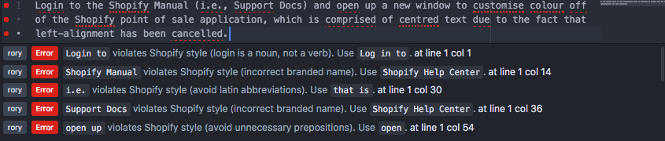

# linter-rorybot

[**Atom**](https://atom.io) [**linter**](https://github.com/AtomLinter/Linter) meets [**rorybot**](https://github.com/Shopify/rorybot) to enforce Shopify content style.

**linter-rorybot** is an Atom package that uses [**rorybot**](https://github.com/Shopify/rorybot) to check for style errors according to the [**retext-shopify**](https://github.com/Shopify/retext-shopify) ruleset.

## Install linter-rorybot in Atom

Installing the linter takes a few steps in your terminal.

### Install the base linter

Most linters depend on a "base" linter package that provides general line highlighting and error message functionality.

1. Open Atom.
2. Press `cmd` + `shift` + `p` to open the command palette.
3. Type `install pack` to  bring up `Settings View: Install Packages And Themes`. Press `enter`.
4. Type `base linter` in the search box and press the **Install** button next to **linter** (the one described as "A Base Linter with Cow Powers.")

### Install the rorybot linter

1. Type `linter-rorybot` in the **Install Packages and Themes** search box and press the **Install** button next to **linter-rorybot**.
2. Quit and reopen Atom.

The next time you launch Atom, the package **linter-rorybot** should be active, and your Markdown and HTML files should be linted according to Shopify style.

## Linting custom file types

By default, **linter-rorybot** works on the following languages:

`source.gfm, text.html.basic, text.html.ruby, text.plain`

You can add custom languages to this list if you normally work with other kinds of files, for example, adding `source.ruby` will enable the style guide linter for Ruby (`.rb`) files.

Note that **adding a custom language overwrites the default list**, so unless you add the default languages in your custom list, the linter will **only** run on the custom languages you've specified.

You may have to restart Atom for changes to your language list to take effect.

## Contributing

Raise issues for the Atom plugin in [this repository](https://github.com/Shopify/linter-rorybot/issues).
Raise issues with **rorybot** in [its repository](https://github.com/Shopify/rorybot/issues).
The styleguide ruleset is in the [retext-shopify repository](https://github.com/Shopify/retext-shopify).
