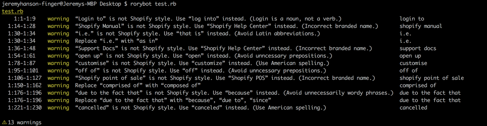

# Rorybot: Catch content style guide violations

**Rorybot** finds style errors by comparing input text against a set of incorrect terms in the [**retext-shopify**](https://github.com/Shopify/retext-shopify) repo. **Rorybot** explains why your word choices are incorrect according to the Shopify content and documentation style guides (for example, "avoid anthropomorphism"), and suggests alternatives.


You can run **rorybot** from the command line, or install plugins for the text editors [Atom](https://github.com/Shopify/linter-rorybot) and [Sublime Text](https://github.com/Shopify/sublimelinter-rorybot) that check your text as you type.



## Installing

1. Make sure you have [**node.js**](https://nodejs.org/en/download/) installed.
2. Open a Terminal window.
3. Run `npm install -g rorybot` to install **rorybot**, which will also install **retext-shopify** as a module within **rorybot**.

If you run into a permissions error, run `sudo npm install -g rorybot` instead.

## Updating

1. Open a Terminal window.
2. Run `npm update -g rorybot` to update **rorybot**, which will also update **retext-shopify**.

## Using the Atom linter

Install **rorybot**, then see the readme for [**linter-rorybot**](https://github.com/Shopify/linter-rorybot).

## Using the Sublime Text linter

Install **rorybot**, then see the readme for [**sublimelinter-rorybot**](https://github.com/Shopify/sublimelinter-rorybot).

## Using the command line

You can run **rorybot** from the command line for extra functionality.

### Check a specific file

Say `example.md` contains the following text:

```md
Login to the Shopify Manual to customise the Shopify point of sale application. 
```

Run **rorybot** on `example.md`:

```sh
rorybot example.md
```

This yields:

```txt
example.md
1:1-1:9    warning  “Login to” is not Shopify style. Use “log into” instead. (Login is a noun, not a verb.)              login to
1:14-1:28  warning  “Shopify Manual” is not Shopify style. Use “Shopify Help Center” instead. (Incorrect branded name.)  shopify manual
1:32-1:41  warning  “customise” is not Shopify style. Use “customize” instead. (Use American spelling.)                  customise
1:46-1:67  warning  “Shopify point of sale” is not Shopify style. Use “Shopify POS” instead. (Incorrect branded name.)   shopify point of sale

⚠ 4 warnings 
```

You can run **rorybot** on any text file type, including Ruby.

### Check a directory

When no input files are given to **rorybot**, it searches for markdown and text files in the current directory.

If you want to search other types of files, you can use wildcards to create your **rorybot** command.

To search all Ruby files within your current directory, for example, run:

```sh
rorybot *.rb
```

To search all Ruby files _recursively_ within your current directory, run:

```sh
rorybot **/*.rb
```

### Write rorybot messages to a file

If you want to write the results of a **rorybot** check to a file, use the `tee` command.

```sh
rorybot *.rb | tee output.txt
```

### Check a string

If you want to check a string within your terminal:

```sh
echo "Login to the Shopify Manual to customise colours in the Shopify point of sale application." | rorybot
```

### Get help

Run `rorybot --help` for more information. You can also check out Titus Wormer's [original alex.js application](https://github.com/wooorm/alex) for info about the API, which we haven't looked into yet.

## Contributing

### Add rules

See the readme in [**retext-shopify**](https://github.com/Shopify/retext-shopify).

### Make changes to rorybot

Create an issue or pull request in this repo.

### Make changes to the Atom linter

See the readme for [**linter-rorybot**](https://github.com/Shopify/linter-rorybot).

### Make changes to the Sublime Text linter

See the readme for [**sublimelinter-rorybot**](https://github.com/Shopify/sublimelinter-rorybot).
